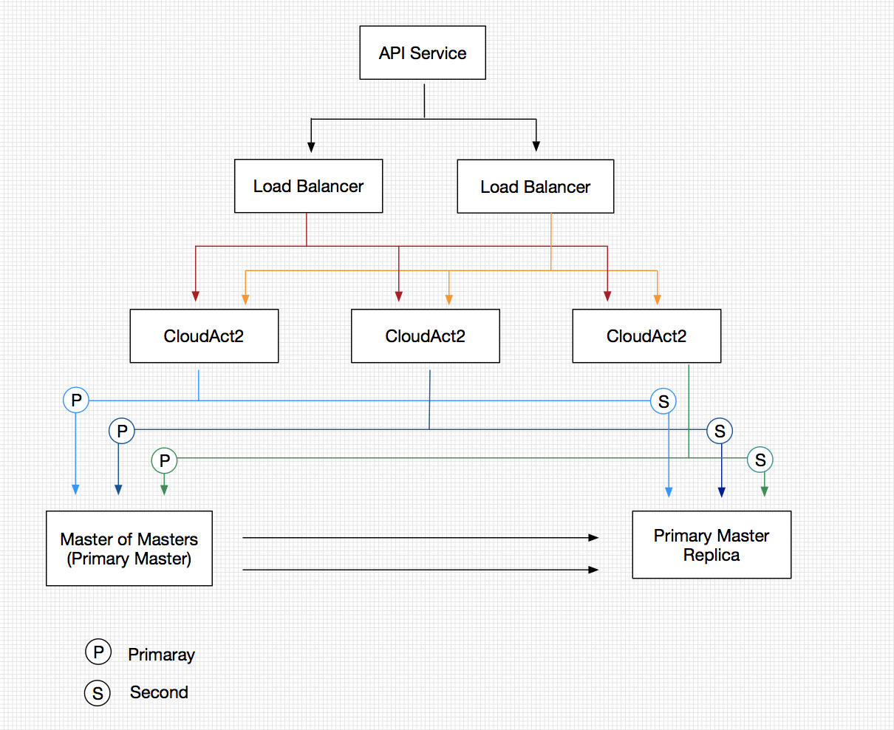

##   cloud-act2的HA方案


### HA示意图

严格意义上的HA：




通常情况，我们可以部署两台CloudAct2，一台LB机器。


### HA策略

CloudAct2需要访问底部的Salt或者MQ或者Proxy的HA暴露出来的接口，每一种HA，都有自己的策略。


- Salt:
  - 多活
  - 主备
- MQ：
  - rabbitmq
    - mirrors
- Proxy
  - 多活
- Kingshard:
  - keepalived的主备
- MySQL：
  - 主备


### HA配置

文件`/usr/yunji/cloud-act2/conf/master.yaml`，其示例内容为：

```yaml
---
# 定义每个需要控制的salt，proxy, puppet的信息
- name: salt-1
  nodes: 
  	- "10.0.0.123"
  	- "10.0.0.124"
  # 策略：有multi-master, master-slaver, mirrors
  policy: "master-slaver" 
  # 在策略为 master-slaver，mirrors时生效
  master: "10.0.0.123"
  # 主备之间的切换策略，依据定义顺序(rr)，随机选择random
  algo: "rr"
  # 类型：salt，rabbitmq, idcos-proxy, kingshard, mysql，可以给每一种类型定义一种策略
  type: "salt"
  
```

act2需要定时向不同的机器发送health的检测，记录下每个节点的状态，如果发现master节点失效，则依据算法规则，切换到有效的节点上。


