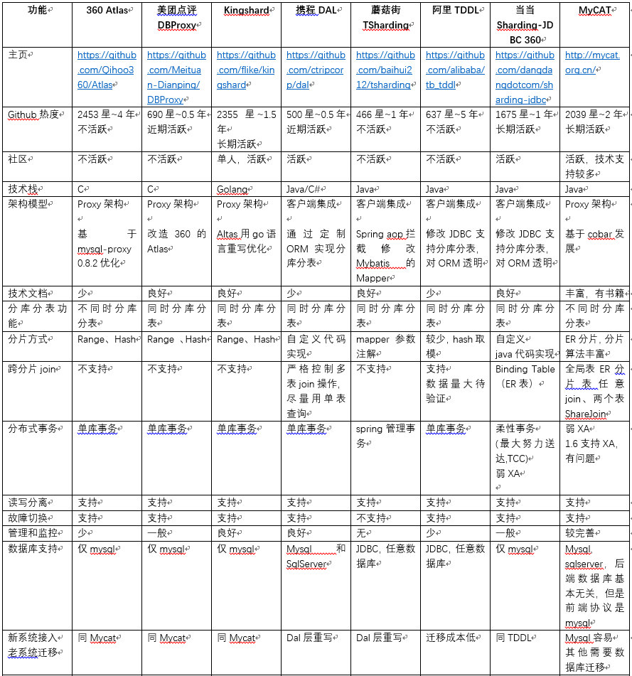

## kingshard 使用


### 原因

​	每次命令执行结束后，会有不少数据需要存储，而命令结果的数据量会比较大，当机器量比较大的时候，常年累月的运行，数据量会非常大。

​	结合数据特征，大部分时候，数据的访问热点，都在当前那个月，所以考虑采用分库分表的方式来构建系统


### 选用



按照上面的分类，排除不活跃的开源项目，所以剩下 kingshard，dal，sharding-jdbc，mycat。考虑我们的 cloud-act2 的会使用 go 来开发，所以 proxy 架构更合适，所以剩下 kingshard 和 mycat。

kingshard 作者之前是在 360 的 Atlas 数据库中间件上做研发的，所以 kingshard 的代码质量是可以有不错的保证，也有不少用户在使用，并且 kingshard 的部署简单，所以选用 kingshard


### 分库分表方式

kingshard 的分库分表，必须预先构建好库和表数据，所以考虑我们的产品规模，使用一个数据库会更简单一些，构建从产品开始到产品结束阶段的所有的 table。


下面以conf的 `CONF_JOB_HOST_RESULT` 为例：


#### CRUD


- 对于分库分表的语句，目前有一些小的要求：插入的时候，必须要指定字段名.

```sql
INSERT INTO `CONF_JOB_HOST_RESULT` (ID, JOB_RECORD_ID, NODE_ID, NODE_IP, RETURN_CODE, START_TIME, END_TIME, STDOUT, STDERR, RUN_AS, EXECUTION_ID, EXECUTE_STATUS, RESULT_STATUS, RESULT_RELATIVE_PATH)  VALUES ('00004dd2-f8e5-48a7-b486-7325b36bcddc','32487fe-68a3-42d2-9c3d-395a8c267821','a6f3b2fa-b6d4-4437-bf9e-8ae6c3ead52c','10.0.0.123',0,'2018-06-19 18:01:00','2018-06-19 18:01:03','119:51:04','mem:85:10:fail:\ncpu:15.5:10:success:\ndisk-/dev/vda1:86:10:fail:\n','','root','1f68de31-6101-4a15-9a1c-976236143221','DONE','SUCCESS',NULL);

```


- 对于查询，则可以去除分表的尾缀，如：

```sql
SELECT * FROM CONF_JOB_HOST_RESULT LIMIT 1;
```

- 删除

```sql
DELETE FROM CONF_JOB_HOST_RESULT WHERE ID = '';
```

  

### proxy 搭建

编译：
```
cd $GOPATH/src/github.com/
git clone https://github.com/flike/kingshard flike/kingshard 
cd flike/kingshard 
source dev.sh
make
```

./bin/kingshard -config etc/conf.yaml -log-level debug


配置请参考官方文档


### 参考

- [怎么使用](https://github.com/flike/kingshard/blob/master/doc/KingDoc/how_to_use_kingshard.md)


